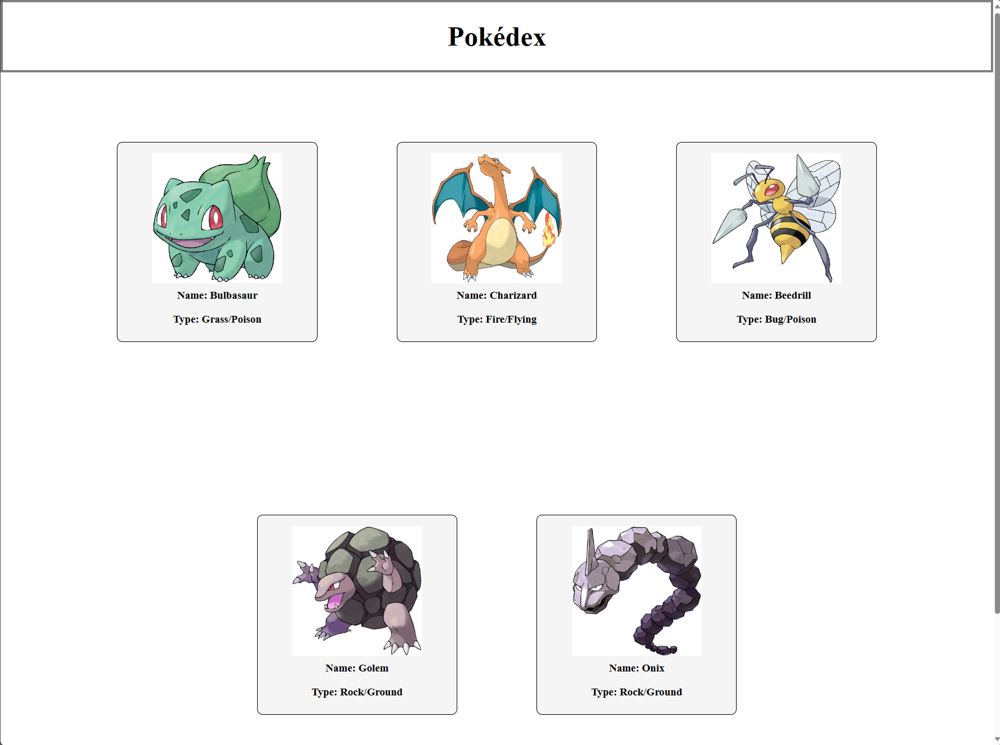
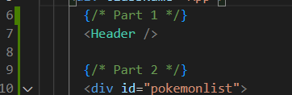

# React Components

## Assignment: Refactoring a React Pokedex Application

#### Overview
In this assignment, you will refactor an existing React application that displays a simple Pokedex, a digital encyclopedia of various Pokémon. The current version of the app has all its logic and UI components in a single file. Your task is to improve the application's structure and maintainability by breaking it down into smaller, reusable components.



### Instructions
You are NOT modifying the display of the page. You are reorganizing the code. The page should look the exact same at the end.

### **Part 1: Header Component**

1. Replace the code for the header element with a custom React component
   - Extract the code for the header element into a new component called `Header`.
      - Create a file called Header.js inside the src folder.

      - Inside Header.js, create a new react component called `Header`

         - Define a component function called Header

         - Configure the function to return the html for the header


         <details>
         <summary>Add an export statement at the bottom of Header.js that exposes the Header component function to other files</summary>

         ```javascript
         export { Header };
         ```
         </details>
   <br/>
   
   - Replace the html code for the Header element inside App.js with the new `Header` component

      - Import the Header functional component from the Header.js file into App.js
      
         <details>
         <summary>Add an import statement to the top of the App.js file that imports the Header function from the Header.js file</summary>

         ```javascript
         import { Header } from "./Header.js"
         ```
         </details>
         <br>

         <details>
         <summary>Replace the HTML code for the header element with a Header React component </summary>
         
         </details>


### **Part 2: Pokemon List Component**
1. Replace the code for the PokemonList element with a custom React component.
   - Extract the code for the PokemonList element into a new component called `PokemonList`.
      - Create a file called PokemonList.js inside the src folder.

      - Inside PokemonList.js, create a new react component called `PokemonList`

         - Define a component function called PokemonList

         - Configure the function to return the html for the PokemonList

         <details>
         <summary>Add an export statement at the bottom of PokemonList.js that exports the component </summary>

         ```javascript
         export { PokemonList };
         ```
         </details>
      
   - Replace the html code for the PokemonList element inside App.js with the new PokemonList component

      - Import the PokemonList functional component from the PokemonList.js file into App.js

         <details>
         <summary>Add an import statement to the top of the App.js file that imports the PokemonList function from the PokemonList.js file</summary>
         
         ``` javascript
            import { PokemonList } from "./PokemonList.js"
            
         ```
         </details>
         <br>
      - Replace the HTML code for the header element with the PokemonList React component

### **Part 3: Footer Component**
1. Replace the code for the Footer element with a custom React component.
